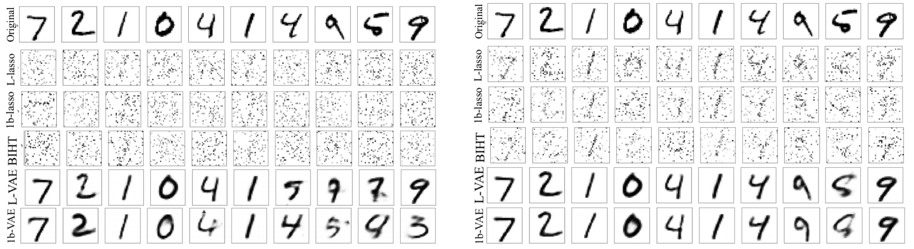

# Sample Complexity Bounds for 1-bit Compressive Sensing and Binary Stable Embeddings with Generative Priors

This repository contains the code for the paper: [Sample Complexity Bounds for 1-bit Compressive Sensing and Binary Stable Embeddings with Generative Priors](https://arxiv.org/abs/2002.01697)

-------------------------------------------------------------------------------------

The paper provide sample complexity bounds for approximate recovery under i.i.d.~Gaussian measurements and a Lipschitz continuous generative prior, as well as a near-matching algorithm-independent lower bound for noiseless 1-bit measurements. Moreover, the results are applied to neural network generative models, and provide a proof-of-concept numerical experiment demonstrating significant improvements over sparsity-based approaches.

## Dependencies

* Python 2.7

* Tensorflow 1.0.1 (preferably with GPU support)

* Scipy

*  PyPNG

## Running the code

-------------------------------------------------------------------------------------

1. Clone the repository

```shell
    $ git clone https://github.com/selwyn96/Quant_CS.git 
    $ cd Quant_CS
```

2. Download the MNIST dataset
 ```shell
    $ ./setup/download_data.sh 
 ```

3. Download/extract pretrained models (courtesy [Bora et al.](https://github.com/AshishBora/csgm)). To train the model from scratch, please visit [Bora et al.](https://github.com/AshishBora/csgm)
```shell
    $ ./setup/download_data.sh 
```
4. To run the code for the VAE:
```shell
    $ python ./src/mnist_main.py
```

## Results from experiment
-------------------------------------------------------------------------------------




## References

Large parts of the code are derived from [Bora et al.](https://github.com/AshishBora/csgm) and [ Shah et al.](https://github.com/shahviraj/pgdgan)